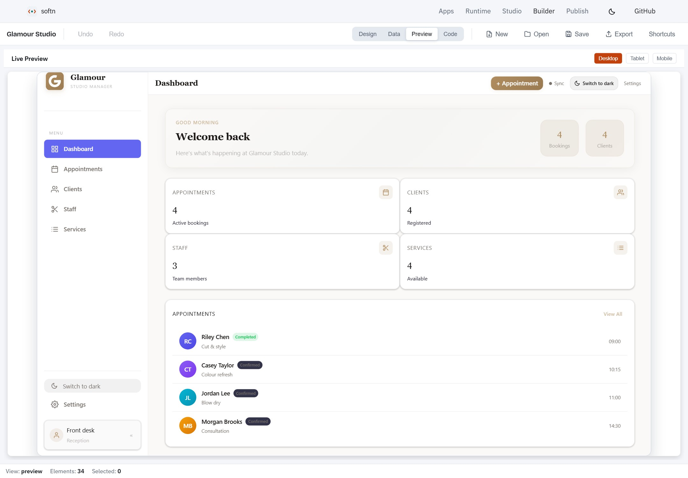
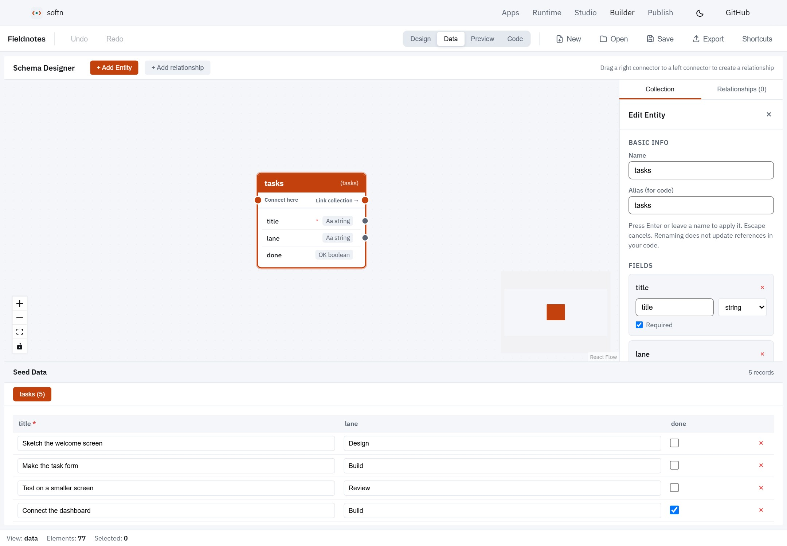
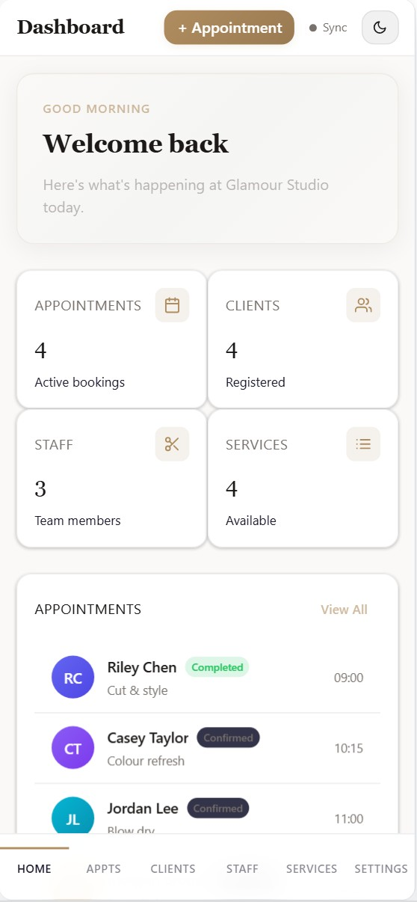
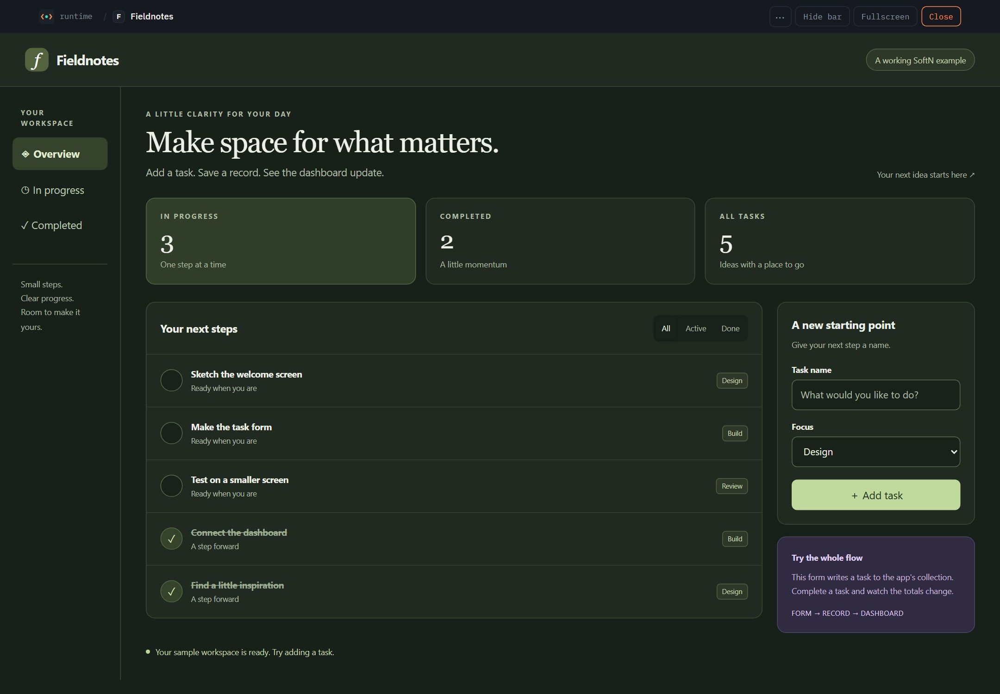

<div align="center">

# SoftN

### Build an app. Keep the source. Run it your way.

A UI language, visual builder and runtime for editable apps on the web and desktop.

[Explore apps](https://softn.com) · [Get started](#get-started) · [FormLogic integration](#connect-to-formlogic) · [Documentation](#documentation)

</div>



_Meet **Fieldnotes**: a working app whose form, logic running on ZIPP and XDB records update one dashboard. This is the actual Builder preview. [Read the source](examples/fieldnotes) · [Get the .softn bundle](apps/softn-site/public/examples/Fieldnotes.softn) · [Screenshot details](docs/readme-assets/README.md)._

SoftN brings the interface, logic and data model together in a portable `.softn` app. Build visually, edit the source, or use your own AI provider in Studio. Open the result in the browser, run it on the desktop, publish it to the app directory, or connect it to FormLogic for a hosted backend.

The project is actively developed. The examples and runtime are usable today; host support and permission boundaries are documented below so you can choose the right deployment.

## What you can build

| Capability                | What it gives you                                                                                                                                                              |
| :------------------------ | :----------------------------------------------------------------------------------------------------------------------------------------------------------------------------- |
| **Interfaces that adapt** | 90 built-in components, themes, forms, tables, charts, dashboards and layouts for different screen sizes.                                                                      |
| **An editable workspace** | A visual builder, schema editor, source editor and live desktop, tablet and mobile previews. Files the canvas cannot safely rewrite remain editable in Code view.              |
| **AI-assisted creation**  | Studio turns a brief into an app using your configured OpenAI, Anthropic or custom provider. You can also write `.ui` and `.logic` directly.                                   |
| **Logic and data**        | JavaScript-compatible `.logic` runs in the zipp Rust/WASM engine. XDB provides app-scoped local records, with synchronization and native storage where the host supports them. |
| **Portable apps**         | A `.softn` bundle carries the editable interface, client logic, data seeds and assets. Reopen it, customize it and export it again.                                            |
| **More than CRUD**        | Audio, microphone input, animation and Three.js scenes are available through components and explicitly granted capabilities.                                                   |

## See an app powered by ZIPP

Fieldnotes is a small task planner you can use, inspect and change. Add a task,
mark it complete and watch the list and totals update. Its `.logic` executes on
[ZIPP](https://github.com/f2i-com/zipp.org); SoftN renders the interface and connects
the script to XDB. No AI provider or account is needed to try it.

| Follow the action | Open the source |
| :---------------- | :-------------- |
| **Enter a task.** The form binds its inputs and calls `addTask()` when you press the button. | [Interface and bindings](examples/fieldnotes/ui/main.ui) |
| **Run the logic.** ZIPP executes validation, creates the task record and refreshes the dashboard; `toggleTask()` updates completion. | [The app's .logic file](examples/fieldnotes/logic/main.logic) |
| **Keep the data.** The bundle supplies the collection schema and five sample tasks. Runtime saves your new records locally. | [Schema, seeds and bundle builder](examples/fieldnotes/build.mjs) |

Open the same bundle in Studio, Builder or Runtime. Change a heading visually,
edit the logic, switch themes or export the result as your own app. Builder's
preview has its own test records; use Data view to edit the seeds you ship.

**[Explore Fieldnotes](examples/fieldnotes/README.md)** · **[Run it locally](#get-started)** · **[Explore games, emulators and more](#demos)**

## From an idea to an app

1. **Start with a brief or a bundle.** Use Studio with your own AI provider, create a project in Builder, or open an existing `.softn` app.
2. **Shape the experience.** Edit pages, navigation, `.logic` behavior and the data model. Keep complex source intact in Code view.
3. **Try the whole flow.** Preview at desktop, tablet and mobile sizes, and use sample records to exercise forms and dashboards.
4. **Export and choose a host.** Run the bundle locally, publish it in the directory, deploy a single app, or host it through FormLogic.

<details>
<summary><strong>Inspect the collection behind the form</strong></summary>



_The same Fieldnotes app in Data view: the `tasks` collection, its field types and the five sample records carried by the bundle._

</details>

<table>
<tr>
<td width="65%" valign="top">
<h3>One app, different screen sizes</h3>
<p>The preview runs the actual app. Switch viewport sizes to check navigation, forms and content before you share it.</p>
<p>This is Fieldnotes running at a phone-sized viewport in dark mode. Its dashboard, filters and task form adapt to the available width, and the page scrolls to the rest of the workspace.</p>
<p>The runtime theme switch updates the app without clearing unfinished input. The same source provides both the warm light palette above and the dark palette shown here.</p>
<p>Responsive behavior still belongs to the app's layout: test your own pages and interactions at the sizes you intend to support.</p>
</td>
<td width="35%" align="center">

</td>
</tr>
</table>

<details>
<summary><strong>See the full app in dark mode</strong></summary>



_A direct screenshot of the running app. Its colours and responsive layout live in the editable `.ui` source._

</details>

## Get started

Use **Node.js 20.19+ on the 20.x line, or 22.12+**, and npm. The browser apps use the checked-in WASM runtime; Rust is only needed for native hosts or rebuilding that engine.

```bash
git clone https://github.com/f2i-com/softn.com.git
cd softn.com
npm ci
npm run build:packages
npm run dev
```

Open the origin printed by the launcher, normally `http://localhost:1420`:

| Path        | Start here to…                                           |
| :---------- | :------------------------------------------------------- |
| `/`         | Learn the workflow and try the editable Fieldnotes app.  |
| `/apps`     | Search and browse the full app directory.                |
| `/builder/` | Create or reopen an app, edit its schema and preview it. |
| `/studio/`  | Configure your AI provider and turn a brief into an app. |
| `/web/`     | Open bundles, explore directory apps and return to your saved library. |

The launcher proxies the browser apps through one origin and picks alternate ports when needed. It also starts the directory API when PHP is available on `PATH`; install PHP to exercise directory browsing, publishing and server storage locally. Fetched examples appear in both the directory and Runtime when demo seeding is enabled. Demo fetching needs network access. To work on Builder alone, use `npm run dev:builder` after the package build.

Runtime keeps apps running when you return to its workspace, so you can browse the directory and open another app without losing an unfinished form. Use **Home** to switch apps, or **Close** to stop the current one. Apps you open are kept in this browser's library; offline readiness is shown for each saved app.

For a first project, open the homepage's **Fieldnotes** example in Builder, select its heading and change **Text Content**, then use **Preview** and **Export**. Use **Open** to bring your exported app back into Studio, Builder or Runtime. Or choose **New** in Builder to start from a blank app. The [Fieldnotes source](examples/fieldnotes) is included in this repository; [softn-Examples](https://github.com/f2i-com/softn-Examples) contains the wider demo catalogue.

## Connect to FormLogic

SoftN supplies the editable app and runtime. [FormLogic](https://formlogic.com) supplies the hosted workspace: forms, records, backend actions and app databases. There are two distinct integration paths:

| Path                               | How it works                                                                                                                                                                                                                                                    |
| :--------------------------------- | :-------------------------------------------------------------------------------------------------------------------------------------------------------------------------------------------------------------------------------------------------------------- |
| **Download a form or app starter** | The canonical [FormLogic adapter](packages/@softn/core/src/integrations/formlogic.ts) converts supported form schemas into an editable `.softn` bundle. It starts with local XDB data and `sync: false`. Responses, credentials and access grants are excluded. |
| **Run a connected workspace**      | The [FormLogic host](apps/formlogic-host/src/main.tsx) renders app source inside an isolated iframe. Client `.logic` calls named backend actions through `softn.backend.call`; the parent owns authentication and applies the selected app's permissions.       |

Use the editable [FormLogic workspace](examples/formlogic-workspace) and [Aokie workspace](examples/aokie-workspace) as examples of connected dashboards. Aokie's app brings calls, appointments, messages, follow-ups and transcripts into one interface; its communication services run through the host integration.

For an app with custom backend `.logic` and SQLite, configure those server resources in the hosting platform and expose the actions the client needs. Keep private scripts, credentials and databases on the server. Downloading the client bundle does not copy a live backend or grant access to it.

The [starter conversion guide](docs/FORMLOGIC_INTEGRATION.md) explains schema mapping and export boundaries. The host source and workspace examples above show the connected runtime; [private backend deployment](apps/softn-rust/PRIVATE_BACKEND.md) covers SoftN's own server host.

## Choose where it runs

| Destination                 | Guide                                                                                                                                   |
| :-------------------------- | :-------------------------------------------------------------------------------------------------------------------------------------- |
| **Browser or desktop**      | Open a bundle in [SoftN Web](apps/softn-web) or the [Tauri loader](apps/softn-loader).                                                  |
| **App directory**           | Publish a bundle with its own page, browser player and server storage. See the [directory guide](apps/softn-api/README.md).             |
| **Your own website**        | Deploy the app in an unbranded [single-app runtime](docs/SINGLE_APP_RUNTIME.md).                                                        |
| **Private PHP deployment**  | Serve a single app from a private archive using the [PHP deployment guide](docs/SINGLE_APP_PHP_SERVE.md).                               |
| **Server logic and SQLite** | Use the [Rust private backend](apps/softn-rust/PRIVATE_BACKEND.md) or [PHP backend packaging](apps/softn-php/SINGLE_APP_DEPLOYMENT.md). |
| **FormLogic**               | Use the connected host and named backend actions described above.                                                                       |

A typical client bundle contains:

```text
my-app.softn
├── manifest.json       # App identity, entry point and metadata
├── permission.json     # Capabilities requested from the runtime
├── ui/                 # Pages and reusable components
├── logic/              # Client behavior
├── xdb/                # Optional collection seeds
└── assets/             # Images, styles and other app assets
```

Capabilities such as network, microphone and synchronization require support and permission from the host. An app's bundle is editable source; include only material you intend to distribute in client downloads.

## Documentation

| Topic                   | Read next                                                                                                                                                      |
| :---------------------- | :------------------------------------------------------------------------------------------------------------------------------------------------------------- |
| Language and components | Expand the reference below for `.ui`, `.logic`, SmartForm, SmartGrid, audio and 3D examples.                                                                   |
| Data modeling           | [Builder collections, ER relationships and record references](docs/BUILDER_DATA.md)                                                                         |
| Loading and composition | [Bundle loading](docs/BUNDLE_LOADING.md) · [Component loading](docs/COMPONENT_LOADING.md) · [Reopening local apps](docs/LOCAL_APP_REOPEN.md)                   |
| Hosting                 | [Single-app runtime](docs/SINGLE_APP_RUNTIME.md) · [Private PHP serving](docs/SINGLE_APP_PHP_SERVE.md) · [Private backend](apps/softn-rust/PRIVATE_BACKEND.md) |
| FormLogic               | [Starter adapter](docs/FORMLOGIC_INTEGRATION.md) · [Connected host](apps/formlogic-host/src/main.tsx) · [Workspace examples](examples)                         |
| Local speech            | [Local speech guide](docs/LOCAL_SPEECH.md)                                                                                                                     |
| Development             | [Setup, tests and key source paths](#development)                                                                                                              |

<details>
<summary><strong>Language, components, runtime and deployment reference</strong></summary>

## Architecture Overview

```
.softn/.ui Source
      |
      v
  +-------+     +---------+     +----------+     +----------+
  | Lexer | --> | Parser  | --> | Renderer | --> |  React   |
  +-------+     +---------+     +----------+     +----------+
   Tokens         AST             Elements         Display
                                    |
                                    v
                            Component Registry
                           (90 built-in + custom)

.logic Source
      |
      v
  +-------+     +---------+     +----------+     +----------+
  | Lexer | --> | Parser  | --> | Compiler | --> | zipp VM  |
  +-------+     +---------+     +----------+     +----------+
   Tokens         AST            Bytecode        Register-based
                                                 execution (Rust)
```

### State Flow

```
Script VM Globals     <--sync-->  React componentState  -->  Render Context  -->  UI
         |                                                        ^
         v                                                        |
    VM Bridges (db, localStorage, window, navigator)         Expression eval
```

Before each script function call, all React state is synced to VM globals. After the call returns, VM globals are synced back to React state, triggering a re-render.

---

## SoftN Language Syntax

### Quick Example

```xml
<logic>
  let count = 0

  function increment() {
    count = count + 1
  }
</logic>

<App theme="dark">
  <Stack direction="vertical" gap="md" padding="lg">
    <Heading level={1}>Counter</Heading>
    <Text>Count: {count}</Text>
    <Button variant="primary" @click={increment}>Increment</Button>
  </Stack>
</App>
```

### Props, Events, and Data Binding

```xml
// String and expression props
<Button variant="primary" size="md">Click Me</Button>
<Text color={isDark ? "white" : "black"}>{message}</Text>

// Event handlers
<Button @click={handleClick}>Click</Button>

// Two-way binding
<Input :bind={username} placeholder="Enter name" />

// Conditional rendering
#if (isLoggedIn)
  <Dashboard />
#else
  <LoginForm />
#end

// Loop rendering
#each (task in tasks)
  <TaskCard task={task} />
#empty
  <Text>No tasks yet!</Text>
#end
```

A handler bound in a template is called without the DOM event: `@click={fn}`
runs `fn()` with the event reduced to `null`, while component callbacks that
carry data (`DPad`'s `@press`, `Slider`'s `@change`) pass it through. A script
that needs pointer coordinates listens on the window instead —
`window.addEventListener("pointerdown", fn)` hands `fn` a plain object with
`clientX`, `clientY`, `key`, `targetTag` and the like. `Box` and `Button`
forward `@pointerdown`, `@pointerup`, `@pointercancel` and `@pointerleave`,
which is enough for a hold-to-press control.

---

## Component Library (90 Components)

| Category   | Count | Components                                                                                                                                      |
| ---------- | ----- | ----------------------------------------------------------------------------------------------------------------------------------------------- |
| Layout     | 15    | `App`, `Box`, `Stack`, `Grid`, `Card`, `Container`, `Center`, `Layout`, `Header`, `Content`, `Section`, `Sidebar`, `Split`, `Spacer`, `Divider` |
| Form       | 12    | `Button`, `Input`, `TextArea`, `Select`, `Checkbox`, `Radio`, `Switch`, `Form`, `Slider`, `DatePicker`, `ColorPicker`, `FileChooser`            |
| Display    | 9     | `Text`, `Heading`, `Badge`, `Tag`, `Avatar`, `Progress`, `Spinner`, `Image`, `Icon`                                                             |
| Feedback   | 6     | `Alert`, `Modal`, `Toast`, `Drawer`, `Popover`, `EmptyState`                                                                                    |
| Data       | 6     | `List`, `ListItem`, `Table`, `DataGrid`, `TreeView`, `Pagination`                                                                               |
| Navigation | 4     | `Tabs`, `Breadcrumb`, `Menu`, `NavItem`                                                                                                         |
| Utility    | 12    | `Accordion`, `Collapse`, `Tooltip`, `Loop`, `PixelGrid`, `PixelCanvas`, `QRCode`, `QRReader`, `Camera`, `Microphone`, `AudioStream`, `DPad`     |
| Charts     | 6     | `LineChart`, `BarChart`, `PieChart`, `AreaChart`, `RadarChart`, `GaugeChart`                                                                    |
| Animation  | 9     | `AnimatedBox`, `AnimatedNumber`, `Marquee`, `Typewriter`, `Draggable`, `SortableList`, `PanView`, `Sprite`, `TileMap`                           |
| Editors    | 3     | `CodeEditor`, `MarkdownEditor`, `RichTextEditor`                                                                                                |
| 3D         | 1     | `Scene3D` (Three.js with GLTF, OBJ, FBX, STL)                                                                                                   |
| Smart      | 7     | `SmartGrid`, `SmartView`, `SmartForm`, `SmartCards`, `SmartList`, `SmartTimeline`, `SmartStats`                                                 |

---

## Smart Components

Auto-configured, data-driven components:

```xml
<SmartGrid
  collection="clients"
  columns="name, email, phone, visits"
  searchable sortable pageable
  editable deletable
  onEdit={editClient}
  onDelete={deleteClient}
/>

<SmartForm
  collection="clients"
  fields="name:text:required, email:email:required, phone:text"
  onSaved={closeModal}
  submitText="Add Client"
/>
```

---

## Bundle Format (.softn)

SoftN applications are distributed as `.softn` bundles (ZIP archives).

```
MyApp.softn (ZIP archive)
+-- manifest.json          # App metadata and configuration
+-- permission.json        # Capabilities the app needs, and what the user approves
+-- ui/main.ui             # Main entry point
+-- logic/main.logic       # Application logic
+-- server/*.logic         # Optional: routes run by softn-server, not the browser
+-- xdb/*.xdb              # Collection data (JSON)
+-- assets/*               # Images, CSS, etc.
```

`permission.json` is not optional in practice. The runtime denies every gated
capability — network, camera, microphone, filesystem, AI, GPU, peer-to-peer sync,
server storage and host acceleration — to a bundle that does not declare it, and the consent prompt is built from what it
declares, so an app that ships without one can run but cannot reach the host:

```json
{ "permissions": { "net": { "enabled": true, "allowed_hosts": ["api.example.com"] } } }
```

Storage identity and permission grants are host-specific. The general bundle loader isolates bundles by digest; configured single-app and FormLogic hosts supply their own deployment identity. A manifest name alone does not grant access to another app's records. See the [single-app identity rules](docs/SINGLE_APP_RUNTIME.md#permissions-and-local-records).

---

## Scripting Engine

`.logic` files are JavaScript, executed by [zipp](https://github.com/f2i-com/zipp.org) -- a clean-sheet
JavaScript engine written in Rust and compiled to WebAssembly.

```
Source Code -> Lexer -> Parser -> Compiler -> Bytecode -> Register-based VM (Rust/WASM)
```

- Real JavaScript: classes, async/await, destructuring, spread/rest, closures, regex
- Rust + WASM register VM with per-call-site inline caches, via `wasm-bindgen`
- True sandboxing: the script reaches nothing the engine preamble does not hand it
- Host modules: `db`, `localStorage`, `window`, `navigator`, `host`, plus the `softn.*` async APIs
- Browser events reach a handler as plain data, the same shape everywhere: a key event carries
  `key`, `code`, the modifiers and `repeat`; a pointer event carries `clientX/Y`, `button`,
  `buttons` and the target's rectangle (`targetLeft/Top/Width/Height`), so a script can place
  the pointer within a canvas scaled to fit its box; both say `targetTag` and `targetEditable`
- `softn.input.captureKeys(["ArrowUp", " ", "F1"])` names the keys a script wants whole: the
  browser's default for them (scrolling, a page search) is cancelled before the handler runs,
  never in a text field and never for a Ctrl chord or the system modifier

The compiled engine is committed at `packages/@softn/core/wasm-zipp/`, so building SoftN needs no
Rust toolchain. The current browser engine is **ZIPP v0.0.17**. Its exact commit, release archive
and SHA-256 checksums are recorded in [SOURCE.json](packages/@softn/core/wasm-zipp/SOURCE.json).
Import an official release with the checksum-verifying vendor script, then rebuild the packages
and whichever apps you ship:

```bash
npm run vendor:zipp-release -w @softn/core -- v0.0.17
npm run build:packages
npm test -w @softn/core
```

For an intentional development build from a sibling `zipp.org` checkout:

```bash
npm run build:zipp-wasm -w @softn/core   # needs rustup + wasm-pack
```

The engine is selected in one place -- `packages/@softn/core/src/runtime/vm-adapter.ts`.

Hosts that already use the same engine can call `configureZippWasmSource(bytes)` before SoftN
initializes. FormLogic uses this to download and verify the binary once, then send copies to
its expression worker and hosted SoftN apps. Each worker or app keeps its own instance, memory
and permissions. See the [FormLogic host integration](apps/formlogic-host/README.md).

```javascript
let clients = [];

function _init() {
  clients = db.query('clients');
}

function addClient(name, email) {
  db.create('clients', { name: name, email: email });
  clients = db.query('clients');
}
```

---

## XDB Database

Local-first, reactive database with P2P synchronization. Source: [xdb.org](https://github.com/f2i-com/xdb.org).

```javascript
let client = db.create('clients', { name: 'John', email: 'john@example.com' });
let allClients = db.query('clients');
db.update(client.id, { phone: '555-1234' });
db.delete(client.id);
await db.startSync('my-room-name');
```

All CRUD operations are **synchronous** (XDB caches everything in memory).

---

## Audio

`softn.audio` plays sound from a `.logic` script. Paths are resolved inside the
bundle, the same way `asset()` resolves them for a template.

```javascript
softn.audio.play('assets/pickup.wav');
softn.audio.play('assets/theme.mp3', { volume: 0.4, loop: true }, function (r) {
  themeHandle = r.handle;
});
softn.audio.setVolume(0.5); // scales what is playing now, and what comes next
softn.audio.stop(themeHandle);
softn.audio.stopAll();
```

No capability is declared for it: a template can already write
`<audio src={asset("…")} autoPlay />` with none, so gating the API and not the
tag would inconvenience the tidier route and secure nothing. Sound reads
nothing and sends nothing, and everything an app started stops when it closes.

Browsers refuse to make noise before the user has interacted with the page. A
one-shot that lands in that window reports `{ played: false, blocked: true }`
rather than throwing — playing it later would be a sound effect at the wrong
moment. Anything `loop`ing is treated as a soundtrack and starts on the first
click or keystroke instead.

---

## Microphone

Listening, unlike playing, is gated: `mic` has to be in `permission.json`, and
the consent prompt names it. The comment above the audio API argues that sound
is a nuisance rather than a disclosure because it "reads nothing, sends
nothing" — a microphone is the thing that fails that test.

```json
{ "permissions": { "mic": { "enabled": true, "maxSeconds": 20 } } }
```

There are two routes. The `<Microphone>` component puts a level meter and a
record button on screen:

```xml
<Microphone
  mode="clip"          // clip | live | level
  sampleRate={48000}
  processing={false}
  maxSeconds={20}
  onCapture={handleClip}   // { dataUrl, duration, sampleRate, sampleCount }
  onSamples={handleWindow} // live mode: { samples, sampleRate, timestamp }
  onLevel={handleLevel}    // { level, peak, clipping }
/>
```

And `softn.mic.*` records without anything visible:

```javascript
softn.mic.record({ seconds: 5, sampleRate: 48000 }, function (r) {
  if (r.recorded) softn.audio.play(r.dataUrl);
});
softn.mic.stop(); // end it early; the record callback still fires
```

Both hand back **uncompressed 16-bit WAV** as a `data:` URL, not MediaRecorder's
Opus. Opus is a speech codec: it reproduces what a voice sounds like, not what
the waveform was. That is fine for a voice note and useless for anything
treating sound as a signal — level analysis, pitch detection, or data over
audio. A WAV is what came off the microphone, so it can be played, saved, or
taken apart sample by sample.

`processing` is the one switch for the browser's echo cancellation, noise
suppression and automatic gain control. It defaults to on, which is right for
speech. Turn it off for anything measuring the sound rather than listening to
it: all three are trained on speech and treat a steady tone as noise to remove,
so a level meter reads low, a tuner drifts, and data sent over audio arrives as
silence.

`sampleRate` is a request, not a promise. The graph is built at the rate asked
for so the samples really are resampled, but hardware and browser both get a
say — every callback reports the rate actually in use, and code that cares
about absolute frequencies must read that rather than assume.

Like `<Camera>`, the component opens the device itself and the browser's own
permission prompt is what stands in front of the hardware; the `mic` capability
gates the scripting API and is what the consent dialog shows the user.

---

## Pixels and PCM

Two primitives for scripts that generate a signal rather than arrange widgets.
Neither is gated: both are sinks, and a script that can already draw a `<Box>`
or play an `<audio>` tag gains nothing it did not have.

`<PixelCanvas>` is the dense-bitmap counterpart to `<PixelGrid>`. PixelGrid
renders sparse `{x, y, color}` cells as DOM nodes, which is right for a board of
a few hundred squares and hopeless for a photograph — 160x144 is 23,040 divs and
around 54ms a frame before the browser paints. PixelCanvas keeps one `ImageData`
and one canvas, pulls frames through a callable prop on its own
`requestAnimationFrame` loop, and never re-renders React.

```xml
<PixelCanvas
  width={160} height={144}
  palette={shades}         // present => 1 byte per pixel; absent => RGBA
  fit="contain"            // fill the box, or "pixel" for whole-number scaling
  getFrame={nextFrame}     // -> { pixels: "<base64>", ... }, or null to hold
  @fps={report}
/>
```

`fit` is the one choice worth making deliberately. `"pixel"` takes the largest
whole multiple that fits and centres it, so every source pixel is the same size
— what pixel art needs, at the cost of a margin. `"contain"` fills the box and
lets the factor go fractional, which is right when filling the frame matters
more than exact geometry.

`<AudioStream>` is the output side of `softn.audio`. That API plays _files_;
this one plays a waveform a script is still generating, which `.logic` cannot do
by itself — it has no `AudioContext`, no `AudioWorklet` and no `Blob`.

```xml
<AudioStream
  getSamples={nextBlock}   // -> { pcm: "<base64>", frames, rate, ... }
  sampleRate={48000} channels={2} format="i16"
  bufferMs={90} muted={muted}
  @ready={started}         // reports the rate the browser ACTUALLY gave
/>
```

It owns the graph and schedules successive buffers at explicit start times so
playback is gapless. `sampleRate` is a request: hardware and browser both get a
say, so `@ready` reports what was really allocated and a script that cares about
pitch must read it rather than assume. The `frames` field of each block is
authoritative too — at 48kHz a 59.7275Hz console frame is 803.65 samples, so the count
genuinely varies and a caller that assumes a constant drifts.

Both are demonstrated by **Pocket**, an 8-bit handheld emulator: `.logic` runs the CPU,
PPU, APU and mappers, PixelCanvas shows the screen and AudioStream is the
speaker.

---

## 3D Scenes

`<Scene3D>` wraps Three.js. Beyond loading models, it carries what a
first-person game needs:

- `type: "instanced"` objects draw thousands of identical meshes in one call:
  a flat `instances` array of positions, with an optional `palette` and a
  fourth number per instance to pick a colour from it.
- `pointerLock` captures the mouse for mouse-look. The scene reports the view
  through `window.__scene3dYaw` and `__scene3dPitch`, whether the lock is held
  through `__scene3dLocked`, and a script asks for it by setting
  `__scene3dWantLock`. `pitchLimit` clamps the look, `cameraSmoothing` eases
  it and `mouseLookSensitivity` scales it. On a touch screen a drag looks
  around instead.
- `attach: "camera"` on an object or light keeps it in front of the player: a
  held block, a torch, a muzzle flash.
- `fill` sizes the canvas to its container, `maxPixelRatio` caps the render
  resolution on high-density screens, and `staticObjects` holds geometry that
  never changes so only the moving list is diffed each frame.

Blockscape, Dead Hours and Maze Escape 3D are built on these. F8 in any of
them shows the engine's debug readout.

---

## Applications

| App               | Description                                                                                                                                                                 |
| ----------------- | --------------------------------------------------------------------------------------------------------------------------------------------------------------------------- |
| **softn-site**    | The softn.com landing page and app directory: browse, search and filter apps, play them in a popup, publish and update your own                                             |
| **softn-web**     | Browser-based `.softn` runtime with multi-tab, URL routing and `?open=` deep links. Installable PWA                                                                         |
| **softn-studio**  | Brief to blueprint to app, against whichever model provider you configure. Installable PWA                                                                                  |
| **softn-builder** | Visual IDE with drag-and-drop editor, live preview, bundle export. Installable PWA                                                                                          |
| **softn-loader**  | Tauri desktop runtime with `.softn` file association and XDB/SQLite                                                                                                         |
| **softn-api**     | The directory behind softn.com: PHP and folder-based JSON, deployed as `/api/` beside the static site. Publishing, versions, comments, ratings, remixes and per-app storage |

The three browser apps are installable PWAs: each ships a web app manifest and a
service worker that precaches the runtime, the component library and the
WebAssembly engine, so they keep working with the network off.

### Deploying softn.com

```bash
npm run build:site
```

Builds the packages, then each app with the `VITE_BASE` matching where it will be
served, and assembles a single uploadable tree. Upload `dist/` to one domain; no
subdomains or cross-origin configuration are required:

```
dist/             landing page and app directory
dist/demos/       the example .softn bundles — only with --with-demos
dist/softn-files/ the same bundles with a download page — only with --with-demos
dist/web/         web runtime
dist/play/        the single-app shell; /play/<slug> is an app's play page, rendered by the API
dist/builder/     visual builder
dist/studio/      AI studio
dist/api/         the directory API (PHP)
dist/data/        the directory's state; never served
dist/.htaccess    Apache rules, with nginx.conf.example and DEPLOY.md alongside
```

Configure the host to serve each app's `index.html` for deep links. The build
writes Netlify/Cloudflare Pages rules to `dist/_redirects` and a GitHub Pages
fallback to `dist/404.html`. On another host, apply the equivalent rewrites:

```text
/web/*     -> /web/index.html
/builder/* -> /builder/index.html
/studio/*  -> /studio/index.html
/*         -> /index.html
```

Two things the host must do beyond rewrites. It runs PHP for `/api/`, the
directory, and for the two pages the API renders, `/app/<slug>` and
`/play/<slug>`. And it sends `Cross-Origin-Opener-Policy: same-origin` and
`Cross-Origin-Embedder-Policy: credentialless` on **every** response, not
only documents: the runtime's worker mode (Pocket, WarbleWire) is a dedicated
worker, and a cross-origin isolated page refuses one whose script arrives
without the embedder policy. The generated `.htaccess` and
`nginx.conf.example` do both; `DEPLOY.md` in `dist/` walks through the rest,
and `GET /api/health` reports what the server found.

Pushing a `v*` tag builds the site in CI and attaches `softn-com-<tag>.zip`
to the GitHub release. `npm run package:site -- --tag vX.Y.Z` makes the same
archive locally.

To exercise that assembled artifact locally on one port before uploading it:

```bash
npm run preview:site
```

This performs a fresh build and serves it at `http://localhost:1420`. Set
`SOFTN_SITE_PORT` if that port is already occupied.

### The app directory

softn.com is a directory of `.softn` apps. Anyone can publish: `POST /api/apps`
with the bundle answers with an **edit key**, and that key, not an account, is
what updates, re-thumbnails or unpublishes the listing later. The site
remembers the keys it has been given in the browser, so "Your apps" on the
publish page finds them again. Visitors can run, rate, comment on and remix
any app; a remix is a new listing that records its parent.

Apps that declare the `storage` capability get a small database of their own
on the server, reached from a script as `softn.storage.*`. Snake's shared top
ten and the Notes board are the worked examples. The routes are described in
[`apps/softn-api/README.md`](apps/softn-api/README.md), and `GET /api` lists
them.

Play goes to `/play/<slug>`: the single-app shell, served by the API with the
app's configuration written into the page, so the page fetches the bundle and
nothing else before the app is on screen. An app runs with what it declares
withheld until the visitor allows it; the site owner can trust an app by
setting `"trusted": true` in the `app` object of its `data/apps/<slug>/app.json`
on the server, and its play page then grants the declaration from the start
with no bar.

To run the directory locally against a built site (PHP 8.1+ with
`pdo_sqlite` and `zip`):

```bash
npm run build:site
php -S 127.0.0.1:5500 -t dist apps/softn-api/router.php
```

The router does what the deployed `.htaccess` does: `/api/` to PHP, `/data/`
refused, `/app/<slug>` a share page with Open Graph tags, and every static
file served with the isolation headers. By default the build ships no example
apps and the directory starts empty: drop `.softn` files on any page to publish
them (a folder at once, with the admin key from `data/config.json` for the site
owner). `npm run build:site -- --with-demos` fetches the pinned softn-Examples
release, ships the bundles under `/demos/` and `/softn-files/`, and has the
directory seed itself from them on the first request — the shape softn.com
itself deploys. Demo changes are refreshed while `seedDemos` is enabled.
You can also copy a folder containing `v1.softn` directly into
`data/apps/<slug>/`: the API discovers it and maintains an `app.json` for its
metadata and social history, with locked atomic updates. Existing SQLite
catalogues migrate automatically; see the API README before upgrading.

### Demos

The included [Fieldnotes teaching app](examples/fieldnotes) is the working example
shown above. Its editable source and `.softn` bundle are checked into this repository.

The downloadable demo catalogue comes from the example applications in
[softn-Examples](https://github.com/f2i-com/softn-Examples): every bundle the
directory lists, as source, with the packer, the validator and the tests. That
repository's `Release` workflow packs them and publishes the archives, and this
repository fetches those release bundles when needed. `apps/softn-web/public/demos/index.json` pins a release
by download URL, size and SHA-256 for each bundle, and `npm run fetch:demos`
downloads whatever is missing or stale and refuses an archive that does not
verify. `dev`, `dev:web`, `build:site --with-demos`, `screenshot:demos` and `test` fetch
first, so a fresh clone needs nothing more than the network the first time.

```bash
node scripts/fetch-demos.mjs --pin v1.0.1   # move to a new release: rewrites the sizes, digests and URLs in index.json, then fetches
node scripts/fetch-demos.mjs --check        # verify what is on disk without downloading
```

Each is a worked example of some part of the runtime.

**Games**

| Demo                   | Description                                                                                                                                                                                   |
| ---------------------- | --------------------------------------------------------------------------------------------------------------------------------------------------------------------------------------------- |
| **Blockscape**         | A first-person voxel sandbox: a 64×64×40 island meshed into `Scene3D` `instanced` batches, pointer-locked camera, gravity, swimming, flight, a day-night cycle, and a world that saves itself |
| **DeadHours**          | A first-person zombie shooter: waves through the gates of a fenced yard at night, a pistol, a shotgun, a camera-attached torch, headshots, pickups and a shared leaderboard                   |
| **MazeEscape3D**       | A first-person maze carved fresh every game, with a minimap that fills in as you explore and a best time that sticks                                                                          |
| **PromptlyUnemployed** | A first-person narrative tragicomedy, fully voiced: laid off by an avatar, home by dinner, a business by midnight                                                                             |
| **TexasHoldem**        | Multiplayer poker over peer-to-peer sync, with bots for a table of one                                                                                                                        |
| **SnakeGame**          | The classic on a `PixelGrid`, with a shared top ten in the app's own server storage                                                                                                           |
| **Twenty48**           | The sliding-tile classic with swipes, undo, a best score and a game that resumes                                                                                                              |
| **Blockfall**          | Falling blocks in a 10×20 `PixelGrid` well: seven pieces, wall kicks, a ghost piece, hold, preview and levels                                                                                 |

**Apps**

| Demo           | Description                                                                                                                                                                                                                                                                                                                                                                                                                                                                                                                                                                                                                   |
| -------------- | ----------------------------------------------------------------------------------------------------------------------------------------------------------------------------------------------------------------------------------------------------------------------------------------------------------------------------------------------------------------------------------------------------------------------------------------------------------------------------------------------------------------------------------------------------------------------------------------------------------------------------- |
| **TheOffice**  | Six characters who talk to each other through a small language model running on the device, on the GPU when there is one and the CPU when there is not                                                                                                                                                                                                                                                                                                                                                                                                                                                                        |
| **AIChat**     | A private chat with a model that downloads once and then never leaves the browser                                                                                                                                                                                                                                                                                                                                                                                                                                                                                                                                             |
| **WarbleWire** | The QXW acoustic transport: text becomes synthetic birdsong and is decoded back, over the air through `Microphone`                                                                                                                                                                                                                                                                                                                                                                                                                                                                                                            |
| **Pocket**     | An 8-bit handheld console emulator. The CPU, PPU, APU, timer and MBC1/2/3/5 mappers are all `.logic`; `PixelCanvas` is the screen and `AudioStream` is the speaker. Runs commercial cartridges at 60fps with sound, save states and battery-backed saves                                                                                                                                                                                                                                                                                                                                                                      |
| **SoftDOS**    | An x86 PC: a 386 integer CPU with a trace compiler, VGA text and Mode X with the graphics controller, an 8042 keyboard, PIT, 8259s, a mouse driver, an AdLib (OPL2 FM synthesizer, rendered on the host through `accel`), a Sound Blaster with 8237 DMA and its interrupt, the PC speaker, and a DOS kernel with a writable drive and DPMI host, all `.logic`, mixed into `AudioStream`. Drop a game's files or its zip on drive C and run it; DOOM plays at its 35 Hz cap with music and effects (a DEFAULT.CFG with sound on is put on the drive if it has none), Jill of the Jungle and other real-mode games as they were |

**Examples** (the directory's Examples category)

| Demo              | Description                                                                                 |
| ----------------- | ------------------------------------------------------------------------------------------- |
| **DeviceKit**     | What a sandboxed app may ask for, one page per permission: network, camera, files, QR codes |
| **Showcase**      | Every chart, animation and interactive component the runtime ships                          |
| **Notes**         | A shared notes board in the app's server-side storage                                       |
| **ThreeDemo**     | Shapes drifting over a floor in `Scene3D`: look around, pick one, add more                  |
| **GPUDemo**       | Vector maths in two compute shaders through the WebGPU bridge                               |

A new demo is added to `index.json` by hand (id, file, name, description and
primary colour) once a release of softn-Examples publishes it, then pinned with
`--pin`. `npm run screenshot:demos` photographs every demo in a headless
browser for the directory's thumbnails under `public/demos/thumbs/`; pass
`--base http://127.0.0.1:5500/web` for the worker-mode apps, which need the
built site.

---

## Host acceleration (`accel`)

A script that generates numeric code at run time — an emulator's compiled
traces, a signal kernel — is limited by the sandbox's interpreter, which runs
a bytecode operation in a few nanoseconds. With the `accel` capability the
script hands such a function to the host, which compiles it with the browser's
own engine and runs it over views of the script's typed arrays, so the compiled
code reads and writes the same bytes the script does:

```js
// Inside a .logic script that declared "accel": { "enabled": true }.
let outer = accel.compile(['RAM', 'ST'], 'return function(ST,h){ST[0]=RAM[h]*2;return 1;};');
let fn = accel.make(outer, 'RAM=g:MY_RAM,ST=g:MY_STATE'); // views of two typed-array globals
accel.state('MY_STATE'); // the array run() passes first
accel.run(fn, 5); // MY_STATE[0] = MY_RAM[5] * 2
```

`compile(params, body)` validates and compiles, answering an id or throwing;
`make(id, spec)` calls that function with the arguments `spec` describes
(`NAME=g:GLOBAL` a view of a typed-array global, `NAME=c:GLOBAL` a callback into
a global function with numbers, `NAME=a:ID` another compiled function,
`NAME=n:NUMBER` a number, `NAME=t` the host's trace table) and answers the id of
the function it returned; `state(GLOBAL)` names the array `run(id, h)` passes as
the first argument; `install(slot, id)` fills the trace table a compiled
function may call through. Every call is synchronous and answers a number; all
of them throw unless the capability was granted.

What keeps it safe: the source must fit a closed arithmetic language
(parameters, `let` locals, labels, keywords and pure `Math` functions; no other
identifier, no member access, no string literals, no `new` or `this`), so a
function that passes can name nothing outside its parameters and locals; the
views cover exactly the arrays the engine resolved and pinned, and index past
them as any typed array does; callbacks carry numbers only and only while a
run is in progress. SoftDOS is the worked example: DOOM went from 5-9 fps to
its own 35 fps cap. The host side is `packages/@softn/core/src/runtime/accel-host.ts`.

---

## Security Model

| Layer             | Protection                                                                                                                                                                                                                     |
| ----------------- | ------------------------------------------------------------------------------------------------------------------------------------------------------------------------------------------------------------------------------ |
| VM Sandboxing     | zipp WASM VM -- no `eval()`, no `new Function()`, no host access                                                                                                                                                               |
| Host acceleration | Only with the `accel` capability, only for source that fits a closed arithmetic language, only over views of the script's own pinned typed arrays                                                                              |
| Execution Limits  | Host-dependent: the worker runtime enforces deadlines and can terminate a runaway worker; `softn-server` uses instrumented step budgets and an abort flag. Main-thread embedding does not have the worker termination boundary |
| Bridge Isolation  | `window` and `navigator` are controlled bridge objects                                                                                                                                                                         |
| localStorage      | App-scoped prefix `softn:{appId}:` separates record keys; host origin isolation remains a separate boundary                                                                                                                    |
| ZIP Extraction    | Rejects `../`, absolute paths, null bytes, Windows drive letters                                                                                                                                                               |

---

</details>

## Development

### Prerequisites

- Node.js 20.19+ on the 20.x line, or 22.12+ (see `package.json` engines)
- npm
- Rust + Cargo (for Tauri apps and WASM compilation)

### Setup

```bash
npm ci
npm run build      # packages in dependency order, then every app
```

`npm run clean` removes build output and stale Vite caches. To remove `node_modules`
as well, use `npm run clean -- --deps` — the bare `--` is what stops npm from eating
the flag before the script sees it.

### Running Apps

```bash
# Everything web on one origin: /, /web/, /builder/ and /studio/
npm run dev

# Or one at a time
npm run dev:site      # landing page   1421
npm run dev:web       # web runtime    1420
npm run dev:builder   # visual builder 1422
npm run dev:studio    # AI studio      1423

# Desktop loader (requires Rust)
npm run dev:desktop

# Builder in its Tauri shell (requires Rust)
npm run dev:desktop:builder

# Build current Windows desktop executables, without installers
npm run build:desktop

# The app directory, against a built site (requires PHP)
npm run build:site && php -S 127.0.0.1:5500 -t dist apps/softn-api/router.php
```

Rust is needed for the two Tauri shells, for `softn-server` (the host that runs a
bundle's `server/` routes and backs XDB sync), and for recompiling the scripting
engine. The four browser apps — the landing page, the runtime, the builder and
Studio — need Node alone.

The desktop runtime and Builder use ports 1431 and 1432, separately from the
unified website. See [desktop apps and the shared bundle workflow](docs/DESKTOP_APPS.md)
for native file dialogs, app transfers, saved-data behavior and manual checks.

The native loader and server use local path dependencies so they can be developed
alongside zipp and XDB. Clone those repositories as siblings of this checkout
before running their Cargo commands:

```bash
git clone https://github.com/f2i-com/zipp.org.git ../zipp.org
git clone https://github.com/f2i-com/xdb.org.git ../xdb.org
cargo test --manifest-path apps/softn-rust/Cargo.toml
```

### Testing

Automatic push/PR CI is temporarily paused. Run the relevant checks locally, or start the [Build SoftN workflow](.github/workflows/build.yml) manually. Tagged releases still use the shared verification workflow.

```bash
npm test                      # every workspace: core, components, web, api (the demo bundles are fetched first)
npm test -w @softn/core       # one of them
npm run lint && npm run typecheck
```

The API suite starts its own `php -S` on a temporary root and seeds it from
the fetched demo bundles; `npm test` fetches them first.

### Key File Paths

| File                                                 | Purpose                                                                                                                                                                                                                      |
| ---------------------------------------------------- | ---------------------------------------------------------------------------------------------------------------------------------------------------------------------------------------------------------------------------- |
| `packages/@softn/core/src/parser/`                   | Lexer and AST parser                                                                                                                                                                                                         |
| `packages/@softn/core/src/renderer/`                 | AST to React renderer and component registry                                                                                                                                                                                 |
| `packages/@softn/core/src/runtime/script-runtime.ts` | Script runtime (state sync, bridges, host calls)                                                                                                                                                                             |
| `packages/@softn/core/src/runtime/vm-adapter.ts`     | Which engine `.logic` runs on                                                                                                                                                                                                |
| `packages/@softn/core/src/runtime/xdb.ts`            | XDB database service                                                                                                                                                                                                         |
| `packages/@softn/core/src/bundle/bundle.ts`          | ZIP bundle reader                                                                                                                                                                                                            |
| `packages/@softn/core/src/loader/SoftNRenderer.tsx`  | Main renderer component                                                                                                                                                                                                      |
| `packages/@softn/components/src/registry.ts`         | Built-in component registration                                                                                                                                                                                              |
| `packages/@softn/components/src/threed/Scene3D.tsx`  | The 3D scene: instancing, pointer lock, attached objects                                                                                                                                                                     |
| `apps/softn-api/index.php`                           | The directory API's routes                                                                                                                                                                                                   |
| `scripts/build-site.mjs`                             | Assembles `dist/` and writes `.htaccess`, `nginx.conf.example` and `DEPLOY.md`                                                                                                                                               |
| `scripts/fetch-demos.mjs`                            | Fetches and verifies the demo bundles from the softn-Examples release `public/demos/index.json` pins                                                                                                                         |
| `scripts/softn-apps/`                                | Every app from every release in `repos.json`, photographed, as one folder a site loads: `npm run apps:build`, then `build:site -- --demos-dir`, an upload beside `api/` as `demos/`, or `apps:publish` (its README explains) |

---

## License

Licensed under the Apache License, Version 2.0. See [LICENSE](LICENSE) and
[NOTICE](NOTICE).

---

## Credits

Built with [zipp](https://github.com/f2i-com/zipp.org), [XDB](https://github.com/f2i-com/xdb.org), [Tauri](https://tauri.app), [React](https://react.dev), [Three.js](https://threejs.org), and [Yjs](https://yjs.dev).
